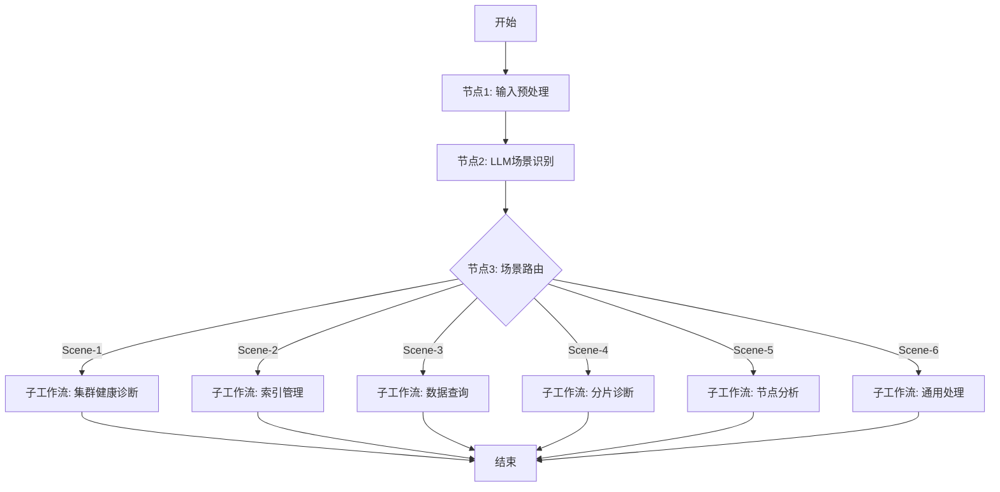
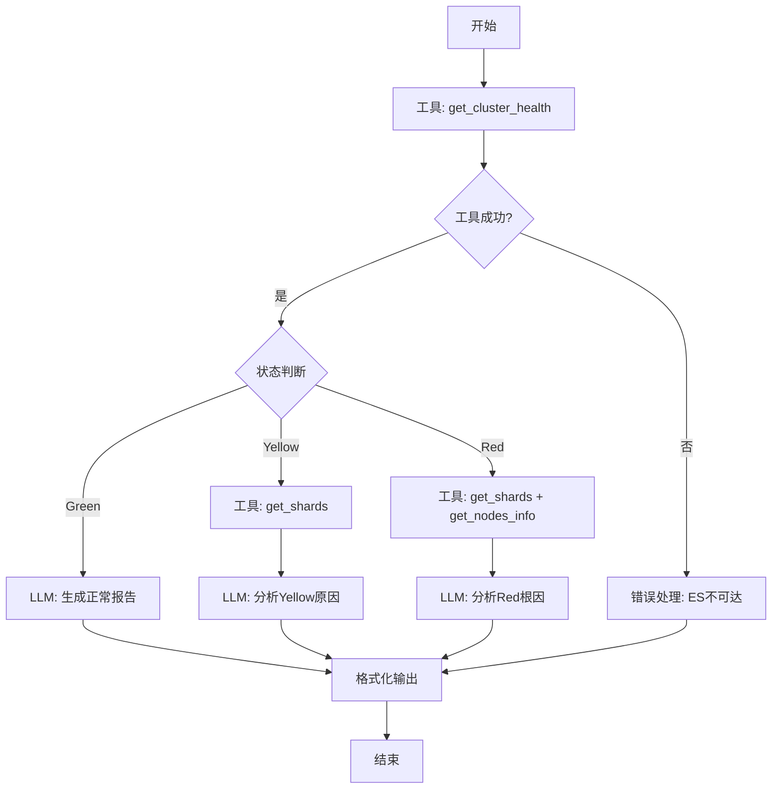
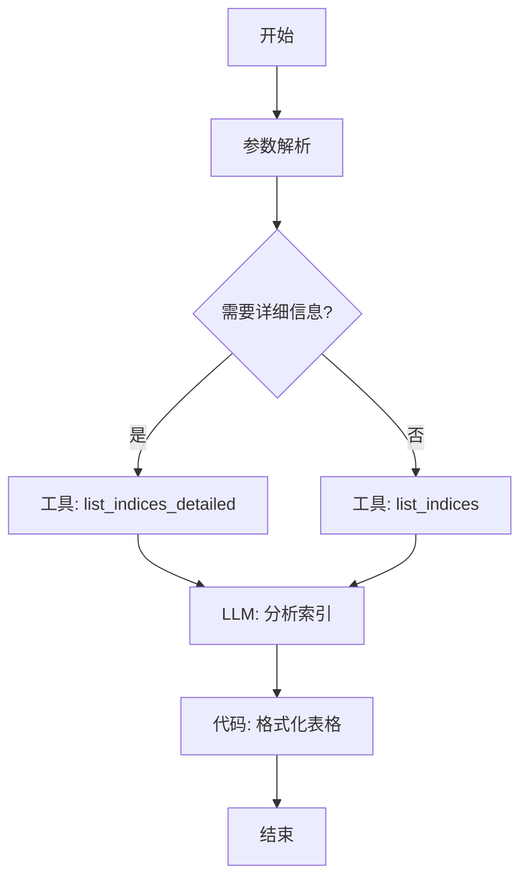
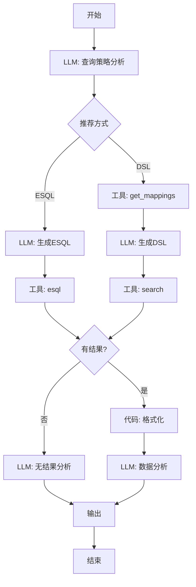
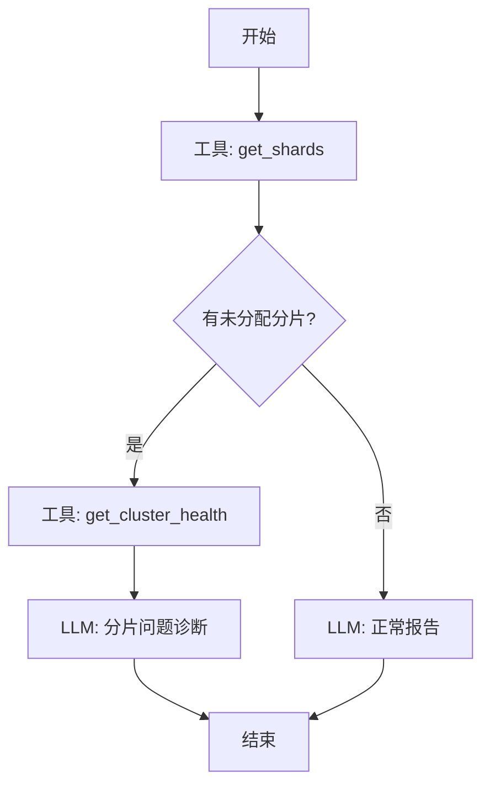
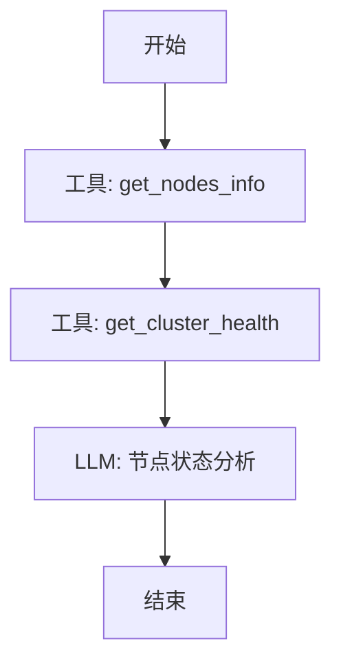
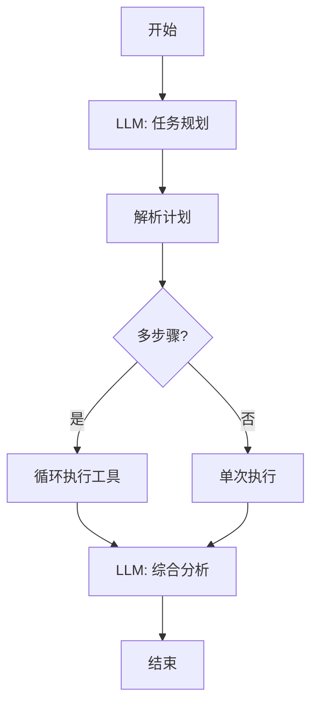

# Elasticsearch MCP - Dify 工作流完整实现方案

> **设计理念**: 全面工作流架构，通过场景识别→智能路由→专用处理的三层结构，将 Agent 推理能力融入结构化流程。从原 ElasticSearchBot.md 的 prompt 精华中提取关键逻辑，转化为可视化工作流。

---

## 目录

1. [架构总览](#一架构总览)
2. [主工作流：智能路由器](#二主工作流智能路由器)
3. [场景工作流详细设计](#三场景工作流详细设计)
   - [场景1：集群健康诊断](#场景-1-集群健康诊断工作流)
   - [场景2：索引管理](#场景-2-索引管理工作流)
   - [场景3：数据查询分析](#场景-3-数据查询分析工作流)
   - [场景4：分片诊断](#场景-4-分片诊断工作流)
   - [场景5：节点分析](#场景-5-节点分析工作流)
   - [场景6：通用处理](#场景-6-通用处理工作流)
4. [错误处理层](#四错误处理与容错)
5. [部署策略](#五部署与测试)

---

## 一、架构总览

### 1.1 三层工作流架构

```
用户输入
   ↓
┌─────────────────────────────────┐
│ 层1：主路由工作流                 │
│ - 输入预处理                      │
│ - LLM场景识别                     │
│ - 智能路由分发                    │
└────────┬────────────────────────┘
         ↓
┌────────────────────────────────────────┐
│ 层2：场景专用工作流 (6个)               │
├────────────────────────────────────────┤
│ Scene-1: 集群健康诊断 (12节点)         │
│ Scene-2: 索引管理 (8节点)             │
│ Scene-3: 数据查询分析 (15节点)         │
│ Scene-4: 分片诊断 (7节点)             │
│ Scene-5: 节点分析 (5节点)             │
│ Scene-6: 通用处理 (10节点)            │
└────────┬───────────────────────────────┘
         ↓
┌─────────────────────────────────┐
│ 层3：统一错误处理层               │
│ - 工具调用失败检测                │
│ - ES不可达降级处理                │
│ - 错误提示与排查建议              │
└─────────────────────────────────┘
```

### 1.2 场景触发规则

| 场景ID | 场景名称 | 触发关键词示例 | 节点数 |
|--------|---------|---------------|--------|
| Scene-1 | 集群健康诊断 | "集群状态"、"为什么变红"、"健康检查" | 12 |
| Scene-2 | 索引管理 | "索引列表"、"哪个索引最大"、"索引信息" | 8 |
| Scene-3 | 数据查询分析 | "查询日志"、"统计分析"、"搜索订单" | 15 |
| Scene-4 | 分片诊断 | "分片未分配"、"分片问题"、"shard" | 7 |
| Scene-5 | 节点分析 | "节点信息"、"节点负载"、"heap使用" | 5 |
| Scene-6 | 通用处理 | 复杂、组合性需求 | 10 |
| **总计** | **6个场景工作流** | **覆盖所有运维场景** | **57** |

### 1.3 Prompt 迁移映射

| 原 ElasticSearchBot.md 章节 | 迁移到工作流 | 实现方式 |
|-----------------------------|-------------|----------|
| Critical Rule (错误处理) | 错误处理层 | 每个工具调用后的条件检查节点 |
| Tools Usage Guidelines § 1 (健康检查) | Scene-1 | LLM推理 + 条件分支 |
| Tools Usage Guidelines § 2 (索引管理) | Scene-2 | 工具调用 + 代码格式化 |
| Tools Usage Guidelines § 3 (数据查询) | Scene-3 | LLM决策（ESQL/DSL）+ 工具调用 |
| Workflow Examples | Scene-1/4/5 | LLM推理节点的System Prompt |
| Error Handling | 错误处理层 | 模板节点 + 诊断建议 |

---

## 二、主工作流：智能路由器

### 工作流名称
`ES-Main-Router`

### 节点流程图



### 节点配置详情

#### 节点1: 输入预处理

**类型**: 代码执行  
**功能**: 从用户输入中提取结构化信息

**代码**:
```python
import re

def main(user_query: str) -> dict:
    """提取索引模式、时间范围等关键信息"""
    query = user_query.strip()
    
    # 提取索引模式 (如: logs-2024.01.01)
    index_patterns = re.findall(r'[\w\-\*]+\-\d{4}(?:\.\d{2})?(?:\.\d{2})?', query)
    
    # 检测时间关键词
    time_map = {
        '最近': 'recent', '昨天': '1d', '今天': 'today',
        '本周': '7d', '上周': '7d_ago', '小时': 'hour'
    }
    detected_time = next((v for k, v in time_map.items() if k in query), None)
    
    return {
        "cleaned_query": query,
        "detected_indices": index_patterns or [],
        "detected_time_range": detected_time
    }
```

**输出变量**:
- `cleaned_query`: 清洗后的查询
- `detected_indices`: 检测到的索引列表
- `detected_time_range`: 时间范围

#### 节点2: LLM场景识别

**类型**: LLM  
**模型**: gpt-4o  
**温度**: 0.1  
**最大Token**: 200

**System Prompt**:
```
你是 Elasticsearch 场景识别专家。分析用户查询，输出最匹配的场景ID。

## 场景定义

- **Scene-1**: 集群健康诊断
  关键词: 集群、状态、健康、green/yellow/red、为什么、慢
  示例: "检查集群状态"、"为什么集群变红了"

- **Scene-2**: 索引管理
  关键词: 索引、index、列表、大小、统计
  示例: "列出所有索引"、"查看索引大小"

- **Scene-3**: 数据查询分析
  关键词: 查询、搜索、日志、错误、统计、分析
  示例: "查询昨天的错误日志"、"统计登录失败次数"

- **Scene-4**: 分片诊断
  关键词: 分片、shard、未分配、relocating
  示例: "为什么有未分配的分片"

- **Scene-5**: 节点分析
  关键词: 节点、node、负载、heap、磁盘
  示例: "查看节点信息"、"哪个节点负载高"

- **Scene-6**: 通用处理
  其他复杂、组合性需求

## 输出格式 (严格JSON，无其他文字)

{
  "scene": "Scene-X",
  "confidence": 0.95,
  "reasoning": "因为用户提到了XX关键词"
}
```

**User Message**:
```
用户查询: {{cleaned_query}}
检测到索引: {{detected_indices}}
时间范围: {{detected_time_range}}

请识别场景。
```

**输出变量**: `scene_result`

#### 节点3: 场景路由

**类型**: 条件分支 (IF/ELIF/ELSE)

**变量提取**:
```python
import json
data = json.loads(scene_result)
scene_id = data["scene"]
return {"scene_id": scene_id}
```

**分支规则**:
- IF `scene_id == "Scene-1"` → 调用子工作流: `ES-Scene1-ClusterHealth`
- ELIF `scene_id == "Scene-2"` → 调用子工作流: `ES-Scene2-IndexManagement`
- ELIF `scene_id == "Scene-3"` → 调用子工作流: `ES-Scene3-DataQuery`
- ELIF `scene_id == "Scene-4"` → 调用子工作流: `ES-Scene4-ShardDiagnosis`
- ELIF `scene_id == "Scene-5"` → 调用子工作流: `ES-Scene5-NodeAnalysis`
- ELSE → 调用子工作流: `ES-Scene6-GeneralHandler`

**子工作流传参**:
- `user_query`: {{cleaned_query}}
- `detected_indices`: {{detected_indices}}
- `detected_time_range`: {{detected_time_range}}
- `scene_info`: {{scene_result}}

---

## 三、场景工作流详细设计

### 场景 1: 集群健康诊断工作流

#### 工作流名称
`ES-Scene1-ClusterHealth`

#### 设计目标
借鉴 ElasticSearchBot.md 的 "Workflow Examples 场景1"，实现：
- Green状态 → 生成正常报告
- Yellow状态 → 调用 get_shards，分析副本未分配原因
- Red状态 → 调用 get_shards + get_nodes_info，定位故障节点

#### 节点流程图（12个节点）



#### 关键节点配置

**节点2: 工具 - 集群健康检查**

**类型**: 工具  
**工具**: `elasticsearch-mcp.get_cluster_health`  
**参数**: `{}`  
**超时**: 10秒  
**错误处理**: 继续（不中断）  
**输出**: `cluster_health`

**节点3: 条件 - 检查工具是否成功**

**类型**: IF/ELSE  
**条件**:
```
{{cluster_health}} is not None 
AND {{cluster_health.status}} is defined
```
**说明**: 如果工具返回null或错误，跳转到错误处理节点

**节点4: 模板 - ES不可达错误处理**

**类型**: 模板  
**内容**:
```
⚠️ **无法连接到 Elasticsearch 集群**

**检测到的问题**: 工具调用超时或返回错误

**可能原因**:
1. ❌ Elasticsearch 服务未启动
2. ❌ 网络不可达（防火墙、路由问题）
3. ❌ MCP Server 配置错误 (ES_URL)
4. ❌ 认证失败 (API Key/密码错误)

**立即排查**:
# 检查ES服务
docker ps | grep elasticsearch
systemctl status elasticsearch

# 测试连通性
curl http://<ES_HOST>:9200/_cluster/health?pretty

# 查看MCP日志
docker logs elasticsearch-mcp-server --tail 50

🔍 **配置检查**: 
- docker-compose.yml 中 ES_URL 是否正确
- ES_API_KEY 或 ES_USERNAME/PASSWORD 是否已设置

⏸️ 请解决上述问题后重试。
```
**输出**: `error_report`

**节点10: LLM - Yellow原因分析**

**类型**: LLM  
**模型**: gpt-4o  
**温度**: 0.2  
**最大Token**: 800

**System Prompt**:
```
你是 Elasticsearch 故障诊断专家。集群 YELLOW 意味着副本分片未完全分配。

## 原 Prompt 参考 (ElasticSearchBot.md § 1)

> 如果状态是 yellow：通常意味着副本分片（Replica Shards）未分配。
> 调用 get_shards 查看未分配的分片。

## 你的任务

1. 从分片信息找出所有 **UNASSIGNED** 的副本分片
2. 分析原因:
   - 单节点集群（副本无处分配）
   - 磁盘空间不足 (>85% 默认阈值)
   - 分片分配策略限制
3. 给出具体修复命令

## 输出格式

⚠️ **集群状态: YELLOW**

## 未分配分片

| 索引 | 分片ID | 类型 | 原因 |
|------|--------|------|------|
| ... | ... | ... | ... |

## 根因分析

[详细分析]

## 修复方案

### 方案1: [最可能]
# 命令
```

**User Message**:
```
集群健康:
{{cluster_health}}

分片信息:
{{shards_info}}

用户问题: {{user_query}}
```

**输出**: `yellow_analysis`

**节点11: LLM - Red根因分析**

**类型**: LLM  
**模型**: gpt-4o  
**温度**: 0.2  
**最大Token**: 1000

**System Prompt**:
```
你是 Elasticsearch 紧急故障诊断专家。集群 RED 意味着主分片丢失。

## 原 Prompt 参考 (ElasticSearchBot.md § 1)

> 如果状态是 red：意味着主分片（Primary Shards）丢失，数据可能受损。
> 必须立即调用 get_shards 和 get_nodes_info 定位故障节点。

## 诊断流程

1. **识别问题索引**: 哪些索引的主分片不可用
2. **定位故障节点**: 是否有节点离线
3. **分析根因**:
   - 节点崩溃/网络分区
   - 磁盘满无法写入
   - 分片损坏
4. **评估影响**: 数据丢失风险
5. **制定恢复方案**: 按优先级排序

## 输出格式

🚨 **紧急: 集群状态 RED**

## 问题索引

| 索引名 | 缺失主分片 | 数据影响 |
|--------|----------|---------|
| ... | ... | ... |

## 节点状态

| 节点 | 状态 | 分片数 |
|------|------|-------|
| ... | ... | ... |

## 根因诊断

[详细推理]

## ⚡ 紧急修复步骤

1. [最高优先级]
2. [次要]
3. [后续验证]
```

**User Message**:
```
集群健康:
{{cluster_health}}

分片信息:
{{shards_info_red}}

节点信息:
{{nodes_info}}
```

**输出**: `red_analysis`

---

### 场景 2: 索引管理工作流

#### 工作流名称
`ES-Scene2-IndexManagement`

#### 设计目标
借鉴 ElasticSearchBot.md § 2，实现快速索引列表展示和分析。

#### 节点流程图（8个节点）



#### 关键节点配置

**节点2: 参数解析**

**类型**: 代码执行

**代码**:
```python
def main(user_query: str, detected_indices: list) -> dict:
    """解析用户需求"""
    query_lower = user_query.lower()
    
    # 是否需要详细信息
    detail_keywords = ['大小', 'size', '详细', '健康', 'stats']
    need_detail = any(kw in query_lower for kw in detail_keywords)
    
    # 索引模式
    if detected_indices:
        index_pattern = detected_indices[0]
    elif 'logs' in query_lower or '日志' in query_lower:
        index_pattern = "logs-*"
    else:
        index_pattern = "*"
    
    # 排序
    sort_by = None
    if '大' in query_lower:
        sort_by = "store.size"
    elif '文档' in query_lower:
        sort_by = "docs.count"
    
    return {
        "need_detail": need_detail,
        "index_pattern": index_pattern,
        "sort_by": sort_by
    }
```

**节点6: LLM - 分析索引**

**类型**: LLM  
**模型**: gpt-4o-mini  
**温度**: 0.3

**System Prompt**:
```
你是 Elasticsearch 索引分析专家。

## 原 Prompt 参考 (ElasticSearchBot.md § 2)

> 日常查看：使用 list_indices 获取简洁列表
> 故障排查：使用 list_indices_detailed，利用 sort_by 和 health 参数

## 分析要点

1. **异常检测**: 标记健康状态非green的索引
2. **容量分析**: 识别占用最大的索引
3. **统计**: 总文档数、平均文档数
4. **建议**: 异常索引的处理建议

## 输出格式

## 📊 索引统计

- 总索引数: X
- 健康索引: X green
- 异常索引: X yellow/red

## 📋 索引列表 (前20个)

[表格将由下一节点生成]

## ⚠️ 需要关注

- [如果有异常索引，列出并给建议]
```

**User Message**:
```
索引数据:
{{indices_data}}

用户问题: {{user_query}}
```

**输出**: `index_analysis`

**节点7: 代码 - 格式化表格**

**类型**: 代码执行

**代码**:
```python
import json

def main(indices_data: str, index_analysis: str) -> dict:
    """将数据格式化为Markdown表格"""
    try:
        data = json.loads(indices_data) if isinstance(indices_data, str) else indices_data
        
        if not data:
            return {"output": "未找到匹配的索引。"}
        
        # 构建表格
        table = "| 索引名称 | 健康 | 文档数 | 大小 |\n"
        table += "|----------|------|--------|------|\n"
        
        for idx in data[:20]:
            name = idx.get('index', 'N/A')
            health = idx.get('health', idx.get('status', 'N/A'))
            docs = idx.get('docs.count', idx.get('docs_count', 'N/A'))
            size = idx.get('store.size', idx.get('size', 'N/A'))
            
            # 健康状态图标
            icon = '✅' if health == 'green' else ('⚠️' if health == 'yellow' else '🚨')
            table += f"| {icon} {name} | {health} | {docs} | {size} |\n"
        
        # 合并LLM分析和表格
        final = f"{index_analysis}\n\n## 详细列表\n\n{table}"
        
        if len(data) > 20:
            final += f"\n\n> 共 {len(data)} 个索引，仅展示前20个。"
        
        return {"output": final}
    
    except Exception as e:
        return {"output": f"{index_analysis}\n\n（表格生成失败: {e}）"}
```

---

### 场景 3: 数据查询分析工作流

#### 工作流名称
`ES-Scene3-DataQuery`

#### 设计目标
借鉴 ElasticSearchBot.md § 3，实现 ESQL优先、DSL降级的智能查询策略。

#### 节点流程图（15个节点）



#### 关键节点配置

**节点2: LLM - 查询策略分析**

**类型**: LLM  
**模型**: gpt-4o  
**温度**: 0.1

**System Prompt**:
```
你是 Elasticsearch 查询策略专家。

## 原 Prompt 参考 (ElasticSearchBot.md § 3)

> **选项 A：ES|QL (优先推荐)**
> 对于表格化数据查询、聚合分析或简单过滤，首选 esql 工具。
> 
> **选项 B：Search (DSL)**
> 当需要全文检索、复杂布尔逻辑、嵌套查询时，使用 search 工具。

## 决策规则

**推荐 ESQL**:
- 简单WHERE过滤
- 聚合统计 (COUNT, AVG, SUM)
- 表格化展示
- 时间范围查询

**推荐 DSL**:
- 全文搜索 (Match)
- 复杂布尔逻辑
- 嵌套对象查询
- Highlight或复杂评分

## 输出格式

{
  "recommended_method": "ESQL",
  "reasoning": "因为是简单过滤查询",
  "confidence": 0.9,
  "extracted_info": {
    "target_indices": ["logs-*"],
    "time_range": "1h",
    "filters": {"log.level": "ERROR"}
  }
}
```

**User Message**:
```
用户查询: {{user_query}}
检测到的索引: {{detected_indices}}
时间范围: {{detected_time_range}}
```

**输出**: `query_strategy`

**节点4: LLM - 生成ESQL**

**类型**: LLM  
**模型**: gpt-4o  
**温度**: 0.2

**System Prompt**:
```
你是 ES|QL 专家。

## ES|QL 语法要点

1. 基础: FROM index | WHERE conditions | LIMIT n
2. 时间: @timestamp > NOW() - 1h
3. 过滤: field == "value"
4. 聚合: STATS count = COUNT(*) BY field
5. 排序: SORT field DESC

## 示例

FROM logs-* 
| WHERE @timestamp > NOW() - 1 HOUR AND log.level == "ERROR" 
| SORT @timestamp DESC 
| LIMIT 20

## 输出要求

只输出ES|QL语句，不要解释。
```

**User Message**:
```
需求分析:
{{query_strategy}}

用户问题: {{user_query}}
```

**输出**: `esql_query`

**节点7: LLM - 生成DSL**

**类型**: LLM  
**模型**: gpt-4o  
**温度**: 0.2

**System Prompt**:
```
你是 Elasticsearch DSL 专家。

## 原 Prompt 参考 (ElasticSearchBot.md § 3)

> 前置动作：如果不确定字段名称，先调用 get_mappings
> 参数构造：query_body 必须是合法JSON，必须包含 size，使用 _source 或 fields 控制返回字段

## DSL 规则

1. **必须包含 size**: 控制返回数(默认10)
2. **使用 _source 或 fields**: 只返回需要的字段
3. **时间范围**: range query
4. **全文搜索**: match/multi_match
5. **精确匹配**: term/terms
6. **组合**: bool query

## 输出格式

只输出JSON对象：
{
  "query": { ... },
  "size": 10,
  "_source": ["field1", "field2"],
  "sort": [{"@timestamp": "desc"}]
}
```

**User Message**:
```
需求分析:
{{query_strategy}}

字段映射:
{{mappings}}

用户问题: {{user_query}}
```

**输出**: `dsl_query`

**节点11: LLM - 无结果分析**

**类型**: LLM  
**模型**: gpt-4o-mini  
**温度**: 0.3

**System Prompt**:
```
用户查询未返回结果。分析原因并给出建议。

## 常见原因

1. 时间范围过窄
2. 索引模式不匹配
3. 字段名错误
4. 字段值不匹配
5. 索引为空

## 输出格式

😕 **未查询到匹配的数据**

**可能原因**:
- ...

**建议**:
- 调整时间范围
- 检查索引名称
- ...
```

**User Message**:
```
查询策略:
{{query_strategy}}

执行的查询:
- ESQL: {{esql_query}}
- DSL: {{dsl_query}}

用户问题: {{user_query}}
```

**输出**: `no_result_analysis`

**节点12: LLM - 数据分析**

**类型**: LLM  
**模型**: gpt-4o  
**温度**: 0.3

**System Prompt**:
```
你是数据分析专家。根据查询结果回答用户问题。

## 分析要点

1. **直接回答**: 针对用户问题
2. **数据总结**: 总数、时间范围
3. **异常检测**: 发现异常模式
4. **关键发现**: 3-5个要点
5. **数据展示**: 表格或列表

## 输出格式

## 📊 查询结果

找到 **{{total_count}}** 条记录

## 🔍 关键发现

1. ...
2. ...

## 📋 数据详情

[表格]
```

**User Message**:
```
查询结果:
{{formatted_data}}

统计: 总数{{total_count}}, 返回{{returned_count}}

用户问题: {{user_query}}
```

**输出**: `data_analysis`

---

### 场景 4: 分片诊断工作流

#### 工作流名称
`ES-Scene4-ShardDiagnosis`

#### 节点流程图（7个节点）



#### 关键节点：LLM分片诊断

**类型**: LLM  
**模型**: gpt-4o  
**温度**: 0.2

**System Prompt**:
```
你是 Elasticsearch 分片诊断专家。

## 未分配分片的常见原因

1. **副本分片 + 单节点**: 只有1个节点，副本无处分配
2. **磁盘空间不足**: 使用率 > 85%（默认阈值）
3. **分片分配策略限制**: cluster.routing.allocation.* 配置
4. **分片过大**: 超过节点内存限制
5. **节点故障**: 原节点离线

## 输出格式

⚠️ **检测到 {{unassigned_count}} 个未分配分片**

## 未分配分片列表

| 索引 | 分片 | 类型 | 原因 |
|------|------|------|------|

## 根因分析

## 修复方案

### 方案1: [最可能]
# 命令
```

**User Message**:
```
未分配分片:
{{unassigned_shards}}

集群健康:
{{cluster_health}}
```

**输出**: `shard_diagnosis`

---

### 场景 5: 节点分析工作流

#### 工作流名称
`ES-Scene5-NodeAnalysis`

#### 节点流程图（5个节点）



#### 关键节点：LLM节点分析

**类型**: LLM  
**模型**: gpt-4o  
**温度**: 0.3

**System Prompt**:
```
你是 Elasticsearch 节点性能分析专家。

## 分析维度

1. **节点数量**: 是否满足高可用（建议 >= 3）
2. **角色分配**: Master、Data、Ingest分布
3. **资源使用**: Heap、磁盘、CPU
4. **版本一致性**: 所有节点版本是否一致
5. **负载均衡**: 分片分布是否均匀

## 输出格式

## 🖥️ 节点概览

- 节点总数: X
- 健康节点: X

## 📊 节点列表

| 节点 | 角色 | 版本 | Heap | 磁盘 | 状态 |

## 🔍 分析

### ✅ 正常项
### ⚠️ 需要关注
### 🛠️ 优化建议
```

**User Message**:
```
节点信息:
{{nodes_info}}

集群健康:
{{cluster_health}}
```

**输出**: `node_analysis`

---

### 场景 6: 通用处理工作流

#### 工作流名称
`ES-Scene6-GeneralHandler`

#### 设计目标
处理复杂、组合性需求，LLM动态规划工具调用序列。

#### 节点流程图（10个节点）



#### 关键节点：LLM任务规划

**类型**: LLM  
**模型**: gpt-4o  
**温度**: 0.2

**System Prompt**:
```
你是 Elasticsearch 任务规划专家。将复杂需求拆解为工具调用序列。

## 可用工具

1. get_cluster_health - 集群健康
2. get_nodes_info - 节点信息
3. get_shards - 分片信息
4. list_indices / list_indices_detailed - 索引列表
5. get_mappings - 字段映射
6. search - DSL搜索
7. esql - ESQL查询

## 规划规则

- 按逻辑顺序排列
- 说明每步原因
- 标注依赖关系

## 输出格式

{
  "plan": [
    {
      "step": 1,
      "tool": "get_cluster_health",
      "params": {},
      "reasoning": "先了解集群整体状态"
    },
    {
      "step": 2,
      "tool": "get_shards",
      "params": {},
      "reasoning": "检查分片分布",
      "depends_on": [1]
    }
  ],
  "estimated_steps": 2,
  "complexity": "medium"
}
```

**User Message**:
```
用户需求: {{user_query}}
```

**输出**: `execution_plan`

---

## 四、错误处理与容错

### 4.1 统一错误处理模式

在每个工具调用节点后，添加错误检查节点：

**错误检查模板**:
- **类型**: 条件判断
- **条件**:
  ```
  {{tool_result}} is None 
  OR {{tool_result}} == "" 
  OR "error" in str({{tool_result}})
  ```
- **TRUE分支**: 跳转到错误处理节点
- **FALSE分支**: 继续正常流程

### 4.2 错误响应模板（借鉴 ElasticSearchBot.md Critical Rule）

```markdown
⚠️ **工具调用失败: {{tool_name}}**

**错误信息**: {{error_message}}

**可能原因**:
- Elasticsearch 服务不可达
- 网络超时
- 权限不足（API Key失效）
- 参数错误

**排查建议**:

```bash
# 1. 检查ES服务
docker ps | grep elasticsearch
systemctl status elasticsearch

# 2. 测试连通性
curl http://{{ES_URL}}:9200/_cluster/health?pretty

# 3. 查看MCP日志
docker logs elasticsearch-mcp-server --tail 50

# 4. 验证认证
# 检查 ES_API_KEY 或 ES_USERNAME/PASSWORD 配置
```

**配置检查**:
- `docker-compose.yml` 中 `ES_URL` 是否正确
- 认证信息是否正确
- 网络是否连通

⏸️ 请解决上述问题后重试。
```

### 4.3 降级策略

| 主方案 | 降级方案 | 触发条件 |
|-------|---------|----------|
| ESQL查询 | DSL查询 | ESQL执行失败或不支持 |
| list_indices_detailed | list_indices | 详细接口超时 |
| 多工具调用完整诊断 | 单个get_cluster_health | 连续工具调用失败 |

---

## 五、部署与测试

### 5.1 部署顺序

**阶段1: 核心路由（1天）**
- [ ] 部署主工作流 ES-Main-Router
- [ ] 测试场景识别准确率（目标 > 90%）

**阶段2: 基础场景（3天）**
- [ ] 部署 Scene-1 (集群健康)
- [ ] 部署 Scene-2 (索引管理)
- [ ] 测试错误处理机制

**阶段3: 高级场景（5天）**
- [ ] 部署 Scene-3 (数据查询)
- [ ] 部署 Scene-4/5/6
- [ ] 完整回归测试

### 5.2 测试用例

#### 场景1: 集群健康
```
✅ "检查集群状态" → 应路由到Scene-1 → 调用get_cluster_health
✅ "为什么集群变黄了" → Scene-1 → Green/Yellow/Red分支
❌ 停止ES服务 → 触发错误处理 → 显示诊断建议
```

#### 场景2: 索引管理
```
✅ "列出所有索引" → Scene-2 → list_indices
✅ "哪个索引最大" → Scene-2 → sort_by=store.size
```

#### 场景3: 数据查询
```
✅ "查询昨天的错误日志" → Scene-3 → ESQL路径
✅ "搜索订单号包含123的记录" → Scene-3 → DSL路径
❌ 查询不存在的索引 → 无结果分析
```

### 5.3 性能指标

| 指标 | 目标值 | 监控方式 |
|-----|--------|---------|
| **端到端响应时间** | < 10秒 | Dify工作流日志 |
| **场景识别准确率** | > 90% | 人工抽样验证 |
| **工具调用成功率** | > 95% | 错误日志统计 |
| **错误提示覆盖率** | 100% | 回归测试 |

---

## 六、与原方案对比

### 6.1 架构对比

| 维度 | 原方案（Agent优先） | 新方案（全工作流） |
|-----|-------------------|------------------|
| **核心模式** | Chatflow Agent | Workflow |
| **Prompt使用** | 单个大Prompt | 分散到LLM节点 |
| **场景数量** | 3个简化Workflow | 6个完整Workflow |
| **总节点数** | 15个 | 57个 |
| **灵活性** | 高（LLM自由决策） | 中（结构化） |
| **可控性** | 低（黑盒） | 高（可视化） |
| **调试难度** | 中（依赖日志） | 低（节点级调试） |
| **维护成本** | 低（改Prompt） | 中（改节点） |

### 6.2 Prompt迁移完成度

| 原 ElasticSearchBot.md章节 | 迁移状态 | 位置 |
|---------------------------|---------|------|
| § Critical Rule (错误处理) | ✅ 完成 | 错误处理层 |
| § Tools Usage Guidelines § 1 (健康检查) | ✅ 完成 | Scene-1 LLM节点 |
| § Tools Usage Guidelines § 2 (索引) | ✅ 完成 | Scene-2 |
| § Tools Usage Guidelines § 3 (查询) | ✅ 完成 | Scene-3 |
| § Workflow Examples | ✅ 完成 | Scene-1/4/5 System Prompt |
| § Error Handling | ✅ 完成 | 统一错误处理模板 |

### 6.3 何时使用哪种方案？

**使用原方案（Agent优先）**:
- ✅ 快速原型验证
- ✅ 团队熟悉Prompt Engineering
- ✅ 需求多变、探索性强

**使用新方案（全工作流）**:
- ✅ 生产环境部署
- ✅ 需要审计和合规
- ✅ 需要细粒度错误监控
- ✅ 团队更熟悉可视化流程

---

## 七、总结

### 7.1 核心成果

1. **完整迁移**: 将 ElasticSearchBot.md 的 Agent 能力完整转化为6个工作流
2. **推理保留**: 在关键节点使用 LLM 进行推理，保留智能性
3. **错误强化**: 每个工具调用都有错误检查，借鉴原 Prompt 的 Critical Rule
4. **可视化**: 所有流程可视化，便于调试和维护

### 7.2 节点统计

| 工作流 | 节点数 | 复杂度 |
|--------|--------|--------|
| 主路由器 | 3 | 低 |
| Scene-1 集群健康 | 12 | 中 |
| Scene-2 索引管理 | 8 | 低 |
| Scene-3 数据查询 | 15 | 高 |
| Scene-4 分片诊断 | 7 | 中 |
| Scene-5 节点分析 | 5 | 低 |
| Scene-6 通用处理 | 10 | 高 |
| **总计** | **60** | **- |

### 7.3 优势

- ✅ **可预测性**: 流程明确，行为可控
- ✅ **可调试性**: 节点级日志，易于定位问题
- ✅ **可审计性**: 每步操作可追溯
- ✅ **推理保留**: LLM在关键点进行智能分析

### 7.4 局限性

- ⚠️ **开发周期长**: 60个节点需要较长时间开发和测试
- ⚠️ **灵活性受限**: 无法像Agent那样自由应对新场景
- ⚠️ **维护成本**: 场景变更需要修改工作流结构

---

**文档版本**: v3.0 (全工作流重构版)  
**设计日期**: 2026-01-22  
**设计理念**: 结构化流程 + LLM推理，兼顾可控性与智能性  
**适用场景**: 生产环境、标准化运维、需要审计和合规的企业场景  
**原始Prompt**: 基于 `ElasticSearchBot.md` 完整迁移
