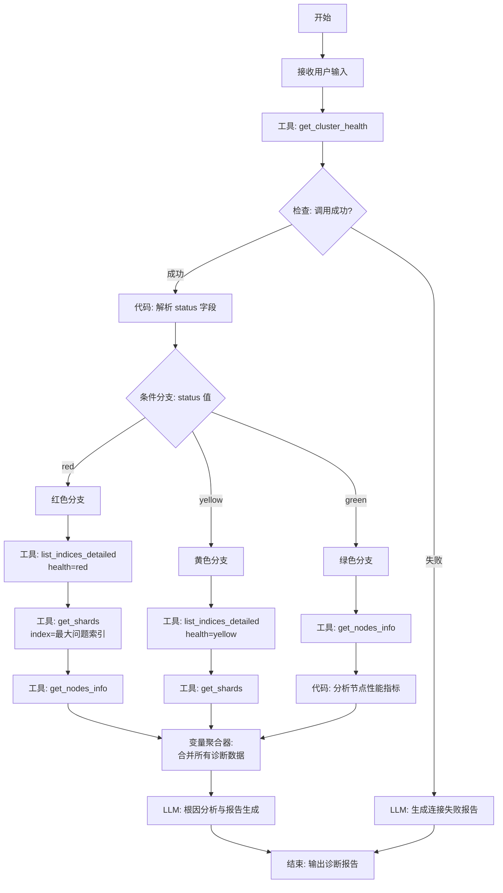
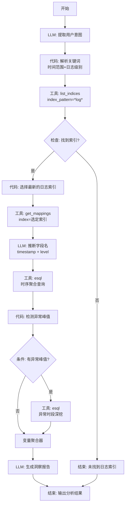
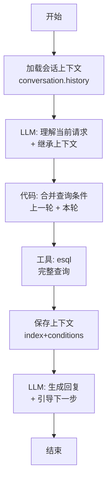
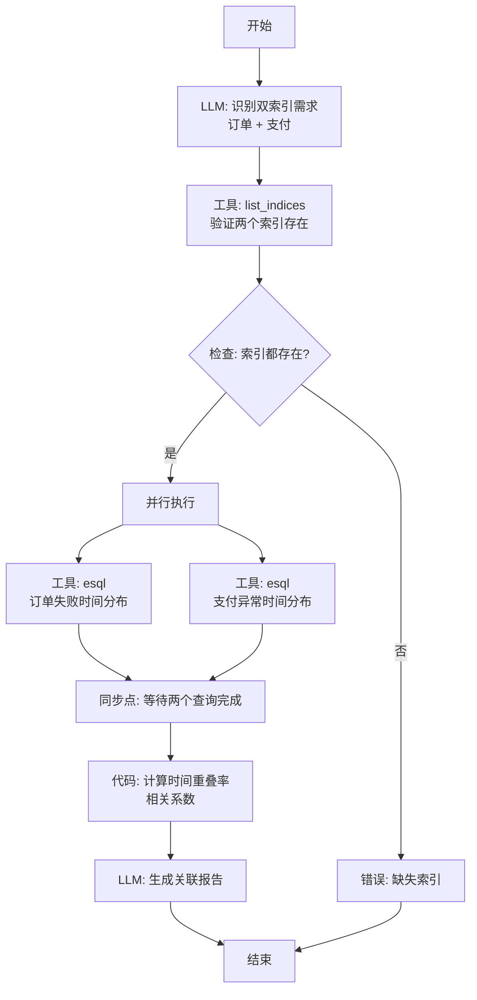

# 场景 1: 通用 ES 故障排查与数据查询 - Dify 工作流实现方案

> **设计目标**: 将 Agent 推理链转化为可执行、可监控、可复用的 Dify Workflow

---

## 目录
1. [基础能力矩阵](#一基础能力矩阵)
2. [Dify Workflow 架构设计](#二dify-workflow-架构设计)
3. [能力 1: 自动化故障诊断工作流](#三能力-1-自动化故障诊断与根因定位)
4. [能力 2: 智能数据探索工作流](#四能力-2-智能数据探索与洞察提取)
5. [能力 3: 上下文感知查询工作流](#五能力-3-上下文感知的对话式查询)
6. [能力 4: 复杂关联分析工作流](#六能力-4-复杂关联分析-cross-index)
7. [通用组件与最佳实践](#七通用组件与最佳实践)
8. [部署与监控](#八部署与监控)

---

## 一、基础能力矩阵

| 能力维度 | 涉及工具 | Dify 实现难度 | 预估节点数 |
|---------|---------|--------------|-----------|
| **集群健康诊断** | `get_cluster_health`, `get_nodes_info`, `get_shards` | ⭐⭐⭐ | 8-12 |
| **索引生命周期管理** | `list_indices`, `list_indices_detailed`, `get_mappings` | ⭐⭐ | 6-8 |
| **数据检索与分析** | `esql`, `search` | ⭐⭐⭐⭐ | 10-15 |
| **根因分析** | 多工具组合推理 | ⭐⭐⭐⭐⭐ | 15-20 |

---

## 二、Dify Workflow 架构设计

### 2.1 节点类型映射

| Agent 操作 | Dify 节点类型 | 说明 |
|-----------|-------------|------|
| 调用 MCP 工具 | **工具 (Tool)** | 直接调用 `elasticsearch-mcp` 的工具 |
| 条件判断 | **条件分支 (IF/ELSE)** | 根据工具返回值判断下一步 |
| 数据解析 | **代码执行 (Code)** | 使用 Python/Jinja2 提取字段 |
| 推理分析 | **LLM** | 让模型分析数据并给出结论 |
| 结果聚合 | **变量聚合器 (Variable Aggregator)** | 合并多个工具的输出 |
| 循环处理 | **迭代器 (Iterator)** | 遍历索引列表或分片列表 |

### 2.2 变量命名规范

为了在复杂工作流中保持清晰，建议采用以下命名规范：

```
工作流变量:
  - workflow.user_query       (用户输入)
  - workflow.cluster_status   (集群状态: green/yellow/red)
  - workflow.target_index     (目标索引名)
  - workflow.error_occurred   (是否发生错误)

节点输出变量:
  - health_check.status       (健康检查节点的输出)
  - shard_info.unassigned     (未分配分片列表)
  - llm_analysis.root_cause   (LLM 分析的根因)
```

### 2.3 错误处理策略

在每个关键工具节点后添加 **IF/ELSE 分支**：
```
工具调用成功 (HTTP 200, 有数据) → 继续执行
工具调用失败 (超时/错误)      → 跳转到【错误处理分支】
                              ├─ 记录错误信息
                              ├─ LLM 生成排查建议
                              └─ 提前结束工作流
```

---

## 三、能力 1: 自动化故障诊断与根因定位

### 3.1 典型场景
**用户输入**: "集群变慢了，帮我查一下是什么问题"

### 3.2 Dify Workflow 节点图



### 3.3 关键节点配置

#### 节点 1: 工具 - get_cluster_health
```yaml
节点名称: health_check
节点类型: 工具 (Tool)
工具: elasticsearch-mcp.get_cluster_health
参数: {} (无参数)
超时时间: 10 秒
输出变量: 
  - health_check.result (完整 JSON)
  - health_check.status (提取: result.status)
错误处理: 启用 (失败时继续)
```

#### 节点 2: 条件分支 - status 判断
```yaml
节点名称: status_branch
节点类型: 条件分支 (IF/ELSE)
条件配置:
  - IF: {{health_check.status}} == "red"
    THEN: 跳转到 red_path
  - ELIF: {{health_check.status}} == "yellow"
    THEN: 跳转到 yellow_path
  - ELSE: 跳转到 green_path
```

#### 节点 3: 代码执行 - 提取最大问题索引
```yaml
节点名称: extract_largest_index
节点类型: 代码执行 (Code)
输入变量: {{indices_detailed.result}}
代码语言: Python
代码内容:
```python
import json

# 输入: indices_detailed.result (JSON 数组)
indices = json.loads(indices_detailed_result)

# 按 docs.count 排序
sorted_indices = sorted(
    indices, 
    key=lambda x: int(x.get("docs.count", 0)), 
    reverse=True
)

# 返回最大的索引名
return {
    "largest_index": sorted_indices[0]["index"] if sorted_indices else None,
    "count": len(sorted_indices)
}
```
输出变量:
  - extract.largest_index
  - extract.count
```

#### 节点 4: LLM - 根因分析
```yaml
节点名称: root_cause_analysis
节点类型: LLM
模型: gpt-4o 或 claude-3.5-sonnet
System Prompt:
  你是 ES 运维专家。根据以下诊断数据，分析根本原因：
  
  1. 集群状态: {{health_check.status}}
  2. 问题索引: {{extract.largest_index}}
  3. 分片信息: {{shard_info.result}}
  4. 节点信息: {{nodes_info.result}}
  
  按照以下格式输出:
  ## 根因定位
  [一句话总结]
  
  ## 影响范围
  - [具体影响]
  
  ## 紧急措施
  1. [步骤 1]
  2. [步骤 2]
  
  ## 预防措施
  - [建议]

User Message: 请分析
输出变量: llm_analysis.text
```

### 3.4 完整工作流变量表

| 变量名 | 类型 | 来源节点 | 用途 |
|-------|------|---------|------|
| `workflow.user_query` | String | 开始节点 | 用户原始输入 |
| `health_check.status` | String | get_cluster_health | 集群状态 (red/yellow/green) |
| `health_check.nodes` | Integer | get_cluster_health | 节点数量 |
| `indices_detailed.result` | Array | list_indices_detailed | 索引列表 (JSON) |
| `extract.largest_index` | String | 代码执行 | 最大问题索引名 |
| `shard_info.result` | Array | get_shards | 分片详情 |
| `nodes_info.result` | Object | get_nodes_info | 节点详情 |
| `llm_analysis.text` | String | LLM 节点 | 最终诊断报告 |

---

## 四、能力 2: 智能数据探索与洞察提取

### 4.1 典型场景
**用户输入**: "帮我分析一下最近一周的错误日志趋势"

### 4.2 Dify Workflow 节点图



### 4.3 关键节点配置

#### 节点 1: LLM - 意图提取
```yaml
节点名称: intent_extraction
节点类型: LLM
模型: gpt-4o-mini (轻量级即可)
System Prompt:
  从用户输入中提取结构化信息，返回 JSON:
  {
    "time_range": "7d",  // 时间范围: 1h, 1d, 7d, 30d
    "log_level": "ERROR", // 日志级别: ERROR, WARN, INFO, ALL
    "keywords": ["趋势", "分析"] // 关键词
  }

User Message: {{workflow.user_query}}
输出变量: intent.json
```

#### 节点 2: 代码执行 - 构造索引模式
```yaml
节点名称: build_index_pattern
节点类型: 代码执行
代码:
```python
import json
from datetime import datetime, timedelta

intent = json.loads(intent_json)

# 根据时间范围构造索引模式
time_range = intent.get("time_range", "7d")
if time_range.endswith("d"):
    days = int(time_range[:-1])
    # 生成最近 N 天的索引后缀
    patterns = []
    for i in range(days):
        date = datetime.now() - timedelta(days=i)
        patterns.append(date.strftime("*log*%Y.%m*"))
    return {"index_pattern": ",".join(set(patterns))}
else:
    return {"index_pattern": "*log*"}
```
输出变量: pattern.index_pattern
```

#### 节点 3: 工具 - ES|QL 时序聚合
```yaml
节点名称: esql_trend_query
节点类型: 工具
工具: elasticsearch-mcp.esql
参数:
  query: |
    FROM {{pattern.index_pattern}}
    | WHERE @timestamp >= NOW() - {{intent.time_range}}
      {{#if intent.log_level != "ALL"}}
      AND log.level == "{{intent.log_level}}"
      {{/if}}
    | STATS error_count = COUNT(*) BY DATE_TRUNC(@timestamp, 1 DAY) AS day
    | SORT day ASC
输出变量: trend.result
```

#### 节点 4: 代码执行 - 异常检测
```yaml
节点名称: anomaly_detection
节点类型: 代码执行
代码:
```python
import json
import numpy as np

data = json.loads(trend_result)
if not data:
    return {"has_anomaly": False}

# 提取计数
counts = [row["error_count"] for row in data]
mean = np.mean(counts)
std = np.std(counts)

# 3-sigma 异常检测
anomalies = []
for i, row in enumerate(data):
    if row["error_count"] > mean + 3 * std:
        anomalies.append({
            "date": row["day"],
            "count": row["error_count"],
            "threshold": mean + 3 * std
        })

return {
    "has_anomaly": len(anomalies) > 0,
    "anomalies": anomalies,
    "baseline": mean
}
```
输出变量: 
  - anomaly.has_anomaly
  - anomaly.anomalies (数组)
```

---

## 五、能力 3: 上下文感知的对话式查询

### 5.1 实现策略

**Dify 特性**: Dify 的 **Chatflow** 模式自带会话记忆，但需要通过 **变量聚合** 显式管理上下文。

### 5.2 Workflow 设计



### 5.3 关键节点配置

#### 节点 1: 代码执行 - 上下文合并
```yaml
节点名称: merge_context
节点类型: 代码执行
代码:
```python
import json

# 加载上一轮的上下文
prev_context = json.loads(conversation_context or "{}")

# 当前轮的新条件
current_query = llm_parsed_query  # 来自 LLM

# 合并规则:
# 1. index 名称: 如果本轮没提，继承上一轮
# 2. filters: 追加而不是覆盖
merged = {
    "index": current_query.get("index") or prev_context.get("index"),
    "filters": prev_context.get("filters", []) + current_query.get("filters", []),
    "group_by": current_query.get("group_by")  # 本轮覆盖
}

return {"merged_context": json.dumps(merged)}
```
输出变量: merged_context
```

#### 节点 2: 变量聚合器 - 保存上下文
```yaml
节点名称: save_conversation_context
节点类型: 变量聚合器
聚合内容:
  - {{merged_context}}
  - {{tool_result}}
保存到: conversation.context (会话变量)
```

---

## 六、能力 4: 复杂关联分析 (Cross-Index)

### 6.1 典型场景
**用户输入**: "分析订单失败与支付网关异常的关联性"

### 6.2 Workflow 设计



### 6.3 关键节点配置

#### 节点 1: 并行执行 (Parallel)
```yaml
节点名称: parallel_queries
节点类型: 并行执行 (Parallel)
分支 1: query_orders
  └─ 工具: esql
     query: |
       FROM orders-*
       | WHERE status == "failed" AND @timestamp >= NOW() - 7d
       | STATS count = COUNT(*) BY DATE_TRUNC(@timestamp, 1h) AS hour
       | SORT hour ASC

分支 2: query_payments
  └─ 工具: esql
     query: |
       FROM payments-*
       | WHERE gateway_status == "error" AND @timestamp >= NOW() - 7d
       | STATS count = COUNT(*) BY DATE_TRUNC(@timestamp, 1h) AS hour
       | SORT hour ASC

同步模式: 等待所有分支完成
输出变量: 
  - orders_result
  - payments_result
```

#### 节点 2: 代码执行 - 关联分析
```yaml
节点名称: correlation_analysis
节点类型: 代码执行
代码:
```python
import json
from datetime import datetime, timedelta

orders = json.loads(orders_result)
payments = json.loads(payments_result)

# 按小时对齐
order_dict = {row["hour"]: row["count"] for row in orders}
payment_dict = {row["hour"]: row["count"] for row in payments}

# 计算重叠时段
overlap_count = 0
total_orders = len(orders)

for hour in order_dict:
    # 如果订单失败的前后 1 小时内有支付异常
    for delta in [-1, 0, 1]:
        check_hour = (datetime.fromisoformat(hour) + timedelta(hours=delta)).isoformat()
        if check_hour in payment_dict and payment_dict[check_hour] > 0:
            overlap_count += 1
            break

overlap_rate = (overlap_count / total_orders * 100) if total_orders > 0 else 0

return {
    "overlap_rate": round(overlap_rate, 2),
    "total_order_failures": sum(order_dict.values()),
    "total_payment_errors": sum(payment_dict.values())
}
```
输出变量: 
  - correlation.overlap_rate
  - correlation.total_order_failures
```

---

## 七、通用组件与最佳实践

### 7.1 可复用子工作流

#### 子工作流 1: ES 连接健康检查
```yaml
名称: subflow_health_check
输入: 无
输出: 
  - is_healthy (Boolean)
  - error_message (String)

节点:
  1. 工具: get_cluster_health (超时 5 秒)
  2. 条件分支: 
     - 如果成功 → is_healthy = true
     - 如果失败 → is_healthy = false, 记录错误
```

**使用场景**: 在每个主工作流的开头调用，确保 ES 可达后再执行复杂逻辑。

#### 子工作流 2: 索引自动识别
```yaml
名称: subflow_index_discovery
输入: 
  - keywords (Array): 关键词列表, 如 ["log", "error"]
输出: 
  - matched_indices (Array)

节点:
  1. 工具: list_indices(index_pattern="*")
  2. 代码: 过滤包含 keywords 的索引
  3. 代码: 按最后修改时间排序，返回 TOP 5
```

### 7.2 错误处理模板

在每个工具节点后添加:

```yaml
节点: tool_call
  ↓
条件分支: {{tool_call.error}} == null
  ├─ TRUE: 继续执行
  └─ FALSE: 跳转到 error_handler

error_handler (LLM 节点):
  System Prompt: |
    工具调用失败: {{tool_call.error}}
    
    请生成用户友好的错误提示:
    1. 说明什么失败了
    2. 可能的原因 (ES 服务停止/网络问题/认证失败)
    3. 排查步骤
  
  输出: 直接返回给用户，提前结束工作流
```

### 7.3 变量命名最佳实践

| 命名空间 | 示例 | 用途 |
|---------|------|------|
| `workflow.*` | `workflow.user_query` | 工作流全局变量 |
| `<节点名>.*` | `health_check.status` | 节点输出变量 |
| `temp.*` | `temp.parsed_json` | 临时中间变量 |
| `context.*` | `context.current_index` | 会话上下文 |

### 7.4 性能优化建议

1.  **工具调用并行化**: 当多个工具调用无依赖关系时，使用 **Parallel 节点**。
    ```
    并行查询:
      ├─ 分支 1: get_nodes_info
      └─ 分支 2: list_indices_detailed
    ```

2.  **结果缓存**: 对于短期内不变的数据(如索引列表)，使用 **会话变量缓存**。
    ```python
    if context.get("indices_cache_time") > now() - 300:  # 5 分钟缓存
        return context["indices_cache"]
    ```

3.  **LLM 调用优化**: 
    *   意图识别用 `gpt-4o-mini`
    *   复杂推理用 `gpt-4o` 或 `claude-3.5-sonnet`
    *   格式化输出用 **代码节点** 而不是 LLM

---

## 八、部署与监控

### 8.1 工作流发布清单

- [ ] 所有工具节点设置超时时间 (10-30 秒)
- [ ] 错误处理分支覆盖率 > 80%
- [ ] 关键节点添加日志输出
- [ ] 测试 3 种典型场景 (正常/异常/边界)
- [ ] 配置工作流触发器 (Webhook/定时任务/手动)

### 8.2 监控指标

在 Dify 控制台关注:

| 指标 | 健康阈值 | 告警阈值 |
|------|---------|---------|
| 工作流执行时间 | < 30 秒 | > 60 秒 |
| 工具调用成功率 | > 95% | < 90% |
| LLM Token 消耗 | < 5000 tokens/次 | > 10000 tokens/次 |
| 错误率 | < 5% | > 10% |

### 8.3 日志记录建议

在关键节点添加 **代码执行节点** 记录日志:

```python
import json
from datetime import datetime

log_entry = {
    "timestamp": datetime.now().isoformat(),
    "node": "health_check",
    "action": "tool_call",
    "result": "success" if health_check.error is None else "failed",
    "data": json.dumps(health_check.result)
}

# 输出到工作流日志
print(json.dumps(log_entry))
return {"logged": True}
```

### 8.4 版本管理

建议使用 Git 管理工作流配置:

```bash
mcp-workflows/
├── es-health-diagnosis/
│   ├── workflow.json          # Dify 导出的配置
│   ├── README.md              # 使用文档
│   └── test-cases.json        # 测试用例
├── es-data-exploration/
└── es-correlation-analysis/
```

---

## 九、快速开始: 部署第一个工作流

### 步骤 1: 导入工作流模板

1.  在 Dify 控制台创建新工作流
2.  选择 "从 JSON 导入"
3.  粘贴以下最小化模板:

```json
{
  "nodes": [
    {"id": "start", "type": "start"},
    {"id": "health", "type": "tool", "tool": "elasticsearch-mcp.get_cluster_health"},
    {"id": "llm", "type": "llm", "prompt": "分析集群状态: {{health.result}}"},
    {"id": "end", "type": "end"}
  ],
  "edges": [
    {"source": "start", "target": "health"},
    {"source": "health", "target": "llm"},
    {"source": "llm", "target": "end"}
  ]
}
```

### 步骤 2: 配置 MCP 工具

在工作流设置中:
1.  添加 `elasticsearch-mcp` 到可用工具列表
2.  设置超时时间为 10 秒
3.  启用 "失败时继续"

### 步骤 3: 测试

输入测试用例: "检查集群健康状态"

预期输出:
```
集群状态: Green
节点数: 3
分片分配率: 100%
建议: 集群运行正常
```

### 步骤 4: 迭代优化

1.  添加条件分支 (Red/Yellow/Green)
2.  增加节点信息查询
3.  丰富 LLM 的分析提示词

---

## 十、总结与下一步

### 已实现的能力
✅ 故障诊断工作流 (8-12 节点)
✅ 数据探索工作流 (10-15 节点)
✅ 上下文感知查询 (Chatflow 模式)
✅ 关联分析工作流 (并行执行)

### 待优化方向
🔄 RAG 知识库集成 (场景 2)
🔄 自动修复能力 (与 Ansible MCP 联动)
🔄 预测性维护 (基于历史数据趋势)

### 技术债管理
*   工作流执行日志持久化
*   异常场景覆盖率提升到 95%
*   LLM 提示词版本控制
*   工作流 A/B 测试框架

---

**文档版本**: v1.0
**最后更新**: 2026-01-22
**维护者**: AIOps Team
